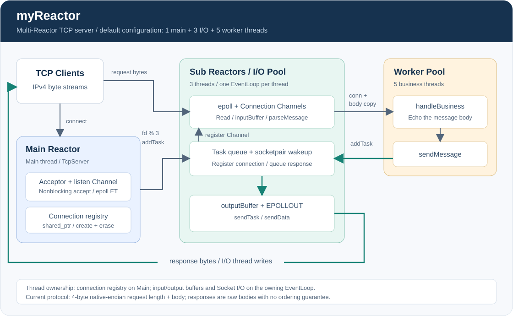
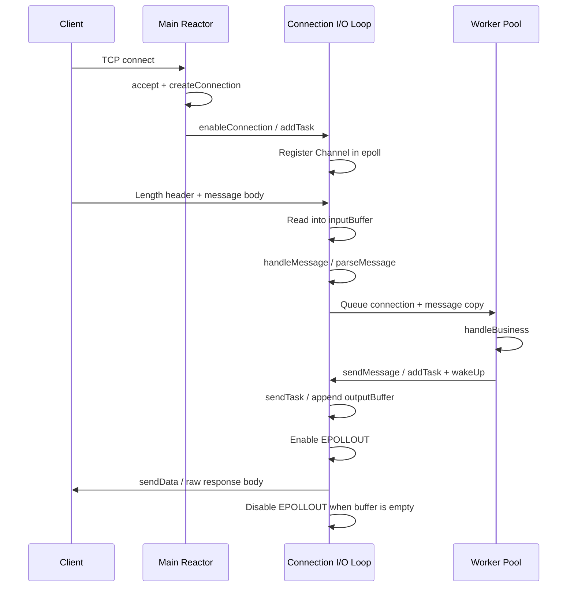

# myReactor

一个使用 **C++、Linux epoll 和非阻塞 Socket** 实现的多 Reactor TCP 网络项目，以 Echo 服务演示从连接建立、事件分发、消息解析到异步响应的完整过程。

项目把网络 I/O 与业务处理分开：主 Reactor 接收连接，子 Reactor 处理连接上的读写事件，工作线程池处理业务，再通过事件循环的任务队列发送响应。适合用来学习 Linux 网络编程、Reactor 模型以及多线程下的连接生命周期管理。

> 当前版本是学习与实验性质的实现，不是可直接面向公网部署的生产级服务器。已有连接注册、缓冲区线程归属等方面的改进，但错误处理、资源限制、协议完整性和安全停止仍有待完善，详见[当前限制与后续方向](#当前限制与后续方向)。

## 导航

- [项目特点](#项目特点)
- [整体架构](#整体架构)
- [一次请求如何完成](#一次请求如何完成)
- [线程归属与连接生命周期](#线程归属与连接生命周期)
- [快速开始](#快速开始)
- [消息协议](#消息协议)
- [源码导览](#源码导览)
- [扩展业务](#扩展业务)
- [当前限制与后续方向](#当前限制与后续方向)

## 项目特点

- **主从 Reactor 模型**：监听 Socket 由主事件循环管理，已建立连接按 `fd % subReactorNum` 分配到子事件循环。
- **非阻塞 I/O 与 ET**：监听和连接 Socket 使用非阻塞模式；读写回调采用循环处理，正常情况下读到 `EAGAIN`、写到缓冲区为空或 `EAGAIN`。
- **独立业务线程池**：消息先在所属 I/O 线程解析，再把连接的智能指针和独立消息副本交给业务线程。
- **任务队列与跨线程唤醒**：`EventLoop::addTask()` 使用互斥锁保护队列，并通过非阻塞 `socketpair` 唤醒等待中的事件循环。
- **异步发送**：业务线程调用 `Connection::sendMessage()` 后，由连接所属事件循环更新输出缓冲区并处理发送。
- **可切换线程配置**：子 Reactor 或业务线程数设为 `0` 时，可分别退化为主循环处理 I/O、I/O 线程直接处理业务。

这些机制已经实现，但不意味着所有异常路径都已覆盖，也不构成吞吐量、并发量或线程安全的性能保证。

## 整体架构



上图展示默认多线程配置。`TcpServer` 持有主事件循环、子事件循环及连接表；每个连接只分配给一个 I/O 事件循环，不会为每个客户端单独创建线程。

| 执行单元 | 默认数量 | 主要职责 |
| --- | ---: | --- |
| 主线程 / Main Reactor | 1 | 监听端口、接受连接、创建连接对象、维护连接表 |
| I/O 线程 / Sub Reactors | 3 | 每个线程运行一个 `EventLoop`，处理所属连接的读写、消息解析和投递任务 |
| 业务线程 / Worker Pool | 5 | 执行 `handleBusiness()`，生成响应并调用异步发送接口 |

默认配置来自 `main.cpp` 中的 `EchoServer server(argv[1], argv[2], 5, 3)`，即 **5 个业务线程、3 个子 Reactor**，合计 9 个应用线程。两类线程池都使用 `ThreadPool`，但任务不同：I/O 线程长期运行事件循环，业务线程执行消息处理任务。

## 一次请求如何完成



1. `Acceptor` 在主线程循环接受新连接；`TcpServer` 创建 `Connection`，设置回调并加入连接表。
2. `Connection::enableConnection()` 把注册任务投递到目标事件循环，避免对象和回调尚未准备好就开始处理事件。
3. 所属 I/O 线程读取数据到 `inputBuffer`，调用 `EchoServer::handleMessage()`，尝试解析完整请求；不完整的报文保留在缓冲区等待后续数据。
4. 如果配置了业务线程，解析出的消息按值传递到工作队列；当前 Echo 业务直接把消息体作为响应。
5. `sendMessage()` 投递发送任务，并捕获连接的 `shared_ptr`；实际的输出缓冲区更新和 Socket 发送发生在所属 I/O 线程。

上述时序描述一条正常请求。多条请求进入业务线程池后，其完成及回复顺序不保证与发送顺序一致。

## 线程归属与连接生命周期

理解这个项目时，除了关注 `epoll`，还需要关注“谁可以修改什么”。在当前默认调用路径中：

| 状态 / 操作 | 所属线程 | 实现方式 |
| --- | --- | --- |
| 连接表 `m_connlist` 的插入、删除 | 主线程 | 建连时直接插入；断连时向主循环投递删除任务 |
| 连接 Channel 的注册、修改、移除 | 连接所属 I/O 线程 | 注册与发送操作通过事件循环任务执行，断连时在读回调中移除 |
| 输入缓冲区读取与消息解析 | 连接所属 I/O 线程 | `recieveMessage()` → `handleMessage()` → `parseMessage()` |
| 业务处理 | 业务线程；业务线程数为 0 时是 I/O 线程 | 传递独立消息副本，不让业务线程继续解析共享输入缓冲区 |
| 输出缓冲区更新与 Socket 发送 | 连接所属 I/O 线程 | `sendTask()` 和 `sendData()` |
| 事件循环及线程池的任务队列 | 允许跨线程投递 | 入队 / 出队由互斥锁保护，任务在释放队列锁后执行 |

连接表保存 `shared_ptr<Connection>`。注册任务、业务任务和发送任务也会持有连接的智能指针，延长异步操作期间的对象生命周期。

读到 EOF 或不可恢复的读取错误时，连接会标记为无效并从 epoll 移除。断连通知先延后到所属 I/O 循环的任务阶段，再通知主循环删除连接表项；对象在最后一个智能指针释放后析构。这个安排用于避免在 Channel 回调执行中立即销毁其所属对象。

`sendMessage()` 是业务侧的发送入口，**返回不表示数据已经写入 Socket，也不表示客户端已经收到响应**。扩展业务时，不要跨线程直接修改 `Buffer` 或调用底层读写方法。

## 快速开始

### 环境要求

- Linux：使用 `epoll`、POSIX Socket、`socketpair` 等接口，不能直接在原生 Windows 或 macOS 上构建。
- 支持 C++11 或更新标准的 `g++`，以及 GNU Make。
- 无第三方 C++ 库依赖；下方 Python 示例需 Python 3。

已在 Raspberry Pi 的 Ubuntu 24.04、aarch64、GCC 13.3 环境验证构建和基本 Echo 收发。不代表所有 Linux 发行版或工具链都已测试。

### 1. 获取源码并编译

```bash
git clone https://github.com/chenggangduan39-sudo/myReactor.git
cd myReactor
make
```

生成两个程序：`server` 和 `client`。当前构建会出现字符串常量传入 `char*` 等编译警告，这些问题仍待整理。

如果工具链报线程相关链接错误，可显式指定标准和线程选项进行编译：

```bash
g++ -std=c++11 -pthread \
    Logger.cpp main.cpp InetAddress.cpp Socket.cpp Epoll.cpp Channel.cpp \
    Acceptor.cpp Connection.cpp TcpServer.cpp EventLoop.cpp Buffer.cpp \
    EchoServer.cpp ThreadPool.cpp -o server
g++ -std=c++11 -pthread Logger.cpp client.cpp -o client
```

### 2. 启动服务端

```bash
./server 127.0.0.1 8080
```

服务端在终端前台运行。参数分别为监听 IPv4 地址和端口；首次实验建议使用回环地址。跨机器测试时，使用服务器的实际 IPv4 地址，并确认网络和防火墙允许连接。

### 3. 运行自带客户端

在另一个终端进入同一目录：

```bash
./client 127.0.0.1 8080
```

客户端会发送一条源码中预设的中文消息；正常情况下，其日志包含 `Connect ok` 和 `Reply:`。它不是交互式聊天客户端，收到回复后仍会继续等待数据，需要按 `Ctrl+C` 结束。服务端也可用 `Ctrl+C` 结束，但当前没有优雅停止流程。

### 4. 用 Python 验证完整收发

保持服务端运行，在另一个终端执行：

```bash
python3 - <<'PY'
import socket
import struct

body = "Hello, myReactor!".encode("utf-8")
# 当前请求头使用主机字节序；此示例要求客户端与服务端字节序一致。
request = struct.pack("=i", len(body)) + body

with socket.create_connection(("127.0.0.1", 8080), timeout=3) as sock:
    sock.sendall(request)
    reply = bytearray()
    # 响应没有长度头，单次 Echo 演示可根据已知请求体长度收取。
    while len(reply) < len(body):
        chunk = sock.recv(len(body) - len(reply))
        if not chunk:
            raise RuntimeError("连接在完整响应到达前关闭")
        reply.extend(chunk)
    assert bytes(reply) == body
    print(reply.decode("utf-8"))
PY
```

预期输出为 `Hello, myReactor!`。不要在发送请求后立即调用 `shutdown(SHUT_WR)`，当前版本尚未正确处理这种 TCP 半关闭场景。

## 消息协议

TCP 提供字节流，单次 `read()` 可能只得到部分请求，也可能同时得到多个请求。当前请求使用长度头区分消息，响应则没有相同的分帧格式。

```text
请求
+---------------------------+-----------------------------+
| 消息体长度：4 字节          | 消息体：length 字节           |
| 主机字节序，有符号 int      | 长度按字节计算，不包含长度头   |
+---------------------------+-----------------------------+

响应
+---------------------------------------------------------+
| 原样返回的消息体，没有长度头，也没有请求 ID                 |
+---------------------------------------------------------+
```

| 项目 | 当前约定 |
| --- | --- |
| 请求长度头 | 从 `int` 直接复制 4 字节，不做网络字节序转换 |
| 消息体 | 按长度取出；Echo 按字节返回，示例文本使用 UTF-8 |
| 不完整请求 | 留在输入缓冲区，后续读取后继续尝试解析 |
| 多个完整请求 | 在 I/O 线程中循环解析，再分别处理业务 |
| 响应 | 裸消息体，多个响应在 TCP 字节流中没有明确边界 |
| 响应顺序 | 默认多业务线程配置不保证按请求顺序回复 |

使用当前协议时，客户端与服务端须对 4 字节整数表示和字节序达成一致。示例请发送非空、较小、合法的消息；零长度消息及非法长度尚未被可靠处理。

不能直接用普通 `telnet` 或裸文本 `netcat` 作为协议客户端，因为它们不会自动加上长度头。上面的 Python 示例仅适合单次 Echo 验证，不是通用的多请求 RPC 客户端。

## 源码导览

| 模块 | 入口文件 | 职责 |
| --- | --- | --- |
| 程序入口 | [main.cpp](main.cpp) | 检查启动参数，配置业务线程数和子 Reactor 数 |
| Echo 应用 | [EchoServer.cpp](EchoServer.cpp) / [EchoServer.h](EchoServer.h) | 解析请求、投递业务任务、返回消息体 |
| TCP 服务管理 | [TcpServer.cpp](TcpServer.cpp) / [TcpServer.h](TcpServer.h) | 组合主从事件循环、分配连接、维护连接表 |
| 接收连接 | [Acceptor.cpp](Acceptor.cpp) / [Acceptor.h](Acceptor.h) | 管理监听 Socket 及其 Channel，循环执行 `accept()` |
| 事件循环 | [EventLoop.cpp](EventLoop.cpp) / [EventLoop.h](EventLoop.h) | 等待事件、执行回调、处理任务队列和跨线程唤醒 |
| 事件分发 | [Channel.cpp](Channel.cpp) / [Channel.h](Channel.h) | 保存 fd、关注事件和读写回调 |
| epoll 封装 | [Epoll.cpp](Epoll.cpp) / [Epoll.h](Epoll.h) | 封装事件注册、修改、移除和等待 |
| TCP 连接 | [Connection.cpp](Connection.cpp) / [Connection.h](Connection.h) | 管理连接资源、输入输出缓冲、异步发送和断连通知 |
| 缓冲区 | [Buffer.cpp](Buffer.cpp) / [Buffer.h](Buffer.h) | 基于 `std::string` 的追加、删除和数据访问 |
| 线程池 | [ThreadPool.cpp](ThreadPool.cpp) / [ThreadPool.h](ThreadPool.h) | 使用互斥锁、条件变量和任务队列调度线程 |
| Socket 与地址 | [Socket.cpp](Socket.cpp) / [InetAddress.cpp](InetAddress.cpp) | Socket 创建、非阻塞设置、绑定监听和 IPv4 地址封装 |
| 日志与客户端 | [Logger.cpp](Logger.cpp) / [client.cpp](client.cpp) | 终端日志输出，以及最小协议客户端 |
| 构建与架构图 | [makefile](makefile) / [docs/architecture.svg](docs/architecture.svg) | 编译两个可执行文件，以及整体架构示意 |

建议阅读顺序：`main` → `EchoServer` → `TcpServer` / `Acceptor` → `EventLoop` / `Epoll` / `Channel` → `Connection` → `ThreadPool` / `Buffer`。

## 扩展业务

最直接的入口是 `EchoServer::handleBusiness(sharedPtrConn conn, std::string message)`。当前实现仅调用 `conn->sendMessage(message)`；可以在这里添加消息转换或业务计算，再通过同一发送接口返回结果。

扩展时注意：

- 业务任务之间可能并行执行，共享业务状态需要单独同步；任务不应直接访问连接的输入输出缓冲区。
- 如需“按连接顺序回复”，应明确设计串行执行或响应重排机制；仅把发送投递回 I/O 线程并不能保证请求顺序。
- 如需 RPC，应同时完善请求和响应分帧、请求 ID、错误响应与超时策略。
- 业务线程数为 `0` 时，业务直接在 I/O 线程执行，耗时操作会阻塞该循环处理其他连接。

## 当前限制与后续方向

本节描述当前代码的边界，不是已完成的功能列表。建议只在可信的本地实验环境中使用。

| 方向 | 当前限制 | 后续完善方向 |
| --- | --- | --- |
| 接收连接错误处理 | 已处理 `EAGAIN`、`EINTR`、`EMFILE`，其他 accept 错误仍可能传递无效 fd；ET 下资源耗尽后缺少可靠恢复机制 | 对有效 fd 做统一检查，补齐错误分类与接收重试 / 恢复 |
| 发送错误处理 | 未防护 `SIGPIPE`，部分发送失败路径可能持续循环 | 处理 `EINTR`、`EPIPE`、`ECONNRESET`，统一断连收尾 |
| 资源与背压 | 非法长度没有可靠校验，输入 / 输出缓冲和任务队列没有容量上限，也没有未完成报文超时 | 增加包长校验、容量限制、超时与背压 |
| TCP 半关闭 | 读到 EOF 时会断连，可能丢弃已经收到的完整请求 | 区分读端关闭与连接失效，处理已收请求并等待响应发送完成 |
| 系统调用失败 | epoll、唤醒通道及部分 Socket 操作缺少完整错误处理 | 传播失败结果，处理唤醒 EOF / 错误，保证注册失败后资源可回收 |
| 停止与异常 | 事件循环没有停止接口，线程池没有停止 / join 机制，任务异常没有捕获策略 | 协调停止、唤醒、任务收尾、线程回收与异常处理 |
| 协议完整性 | 主机字节序、响应无分帧、并行回复可能乱序 | 定义可移植协议和请求 ID，补齐响应分帧与顺序策略 |
| 工程验证 | 尚无仓库内自动化测试、性能基准与 CI 配置；编译警告仍存在 | 补充单元 / 集成测试、异常路径测试、Sanitizer 检查和基准测试 |

项目尚未提供 HTTP、TLS、IPv6、认证等能力，也没有公开的性能数据。欢迎通过 Issue 讨论实现细节，或提交围绕上述方向的小范围改进。
